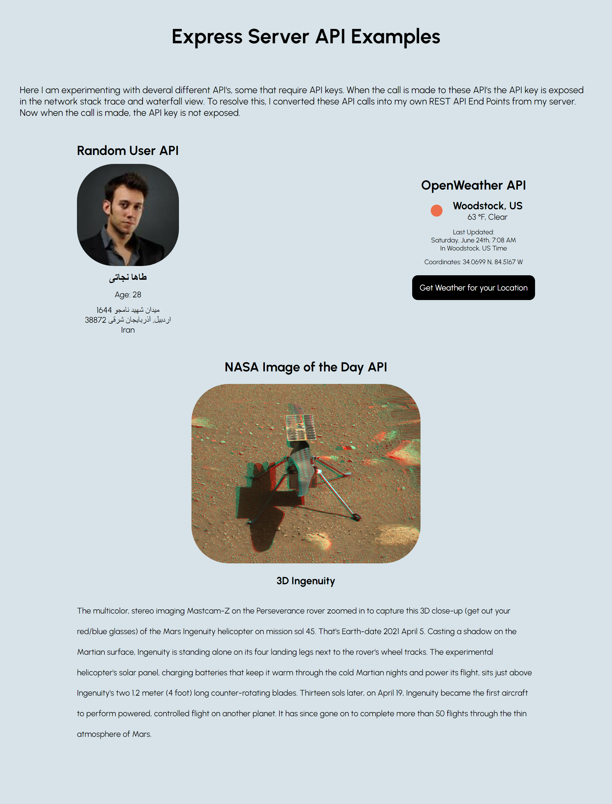

# Express-App




## About
Here I am experimenting with deveral different API's, some that require API keys. When the call is made to these API's the API key is exposed in the network stack trace and waterfall view. To resolve this, I converted these API calls into my own REST API End Points from my server. Now when the call is made, the API key is not exposed.

## Table of Contents  
* [About](#about)
* [Installation](#installation)
* [Usage](#usage)
* [Licensing](#licensing)
* [Questions](#questions)

## Installation
```
git clone git@github.com:strawhat19/Express-App.git
cd Express-App/
npm install
npm run dev
```

## Usage

### View API Data

#### You can view API's I used for this demo and their data!

### Weather in your Area

#### You can get weather in your location as im messing with the Geolocation API. Please don't make too many requests!

## Licensing
#### 
      MIT License

      Copyright (C) 2012-2023 by various contributors (see AUTHORS)

      Permission is hereby granted, free of charge, to any person obtaining a copy
      of this software and associated documentation files (the "Software"), to deal
      in the Software without restriction, including without limitation the rights
      to use, copy, modify, merge, publish, distribute, sublicense, and/or sell
      copies of the Software, and to permit persons to whom the Software is
      furnished to do so, subject to the following conditions:

      The above copyright notice and this permission notice shall be included in
      all copies or substantial portions of the Software.

      THE SOFTWARE IS PROVIDED "AS IS", WITHOUT WARRANTY OF ANY KIND, EXPRESS OR
      IMPLIED, INCLUDING BUT NOT LIMITED TO THE WARRANTIES OF MERCHANTABILITY,
      FITNESS FOR A PARTICULAR PURPOSE AND NONINFRINGEMENT. IN NO EVENT SHALL THE
      AUTHORS OR COPYRIGHT HOLDERS BE LIABLE FOR ANY CLAIM, DAMAGES OR OTHER
      LIABILITY, WHETHER IN AN ACTION OF CONTRACT, TORT OR OTHERWISE, ARISING FROM,
      OUT OF OR IN CONNECTION WITH THE SOFTWARE OR THE USE OR OTHER DEALINGS IN
      THE SOFTWARE.
      
      Copyright 1998 by the Massachusetts Institute of Technology.

      Permission to use, copy, modify, and distribute this software and its
      documentation for any purpose and without fee is hereby granted, provided that
      the above copyright notice appear in all copies and that both that copyright
      notice and this permission notice appear in supporting documentation, and that
      the name of M.I.T. not be used in advertising or publicity pertaining to
      distribution of the software without specific, written prior permission.
      M.I.T. makes no representations about the suitability of this software for any
      purpose.  It is provided "as is" without express or implied warranty.
#### https://opensource.org/licenses/MIT

## Questions

#### GitHub Profile: [*strawhat19*](https://github.com/strawhat19)

#### Contact me or ask me questions at [rahmed@piratechs.com](mailto:rahmed@piratechs.com).